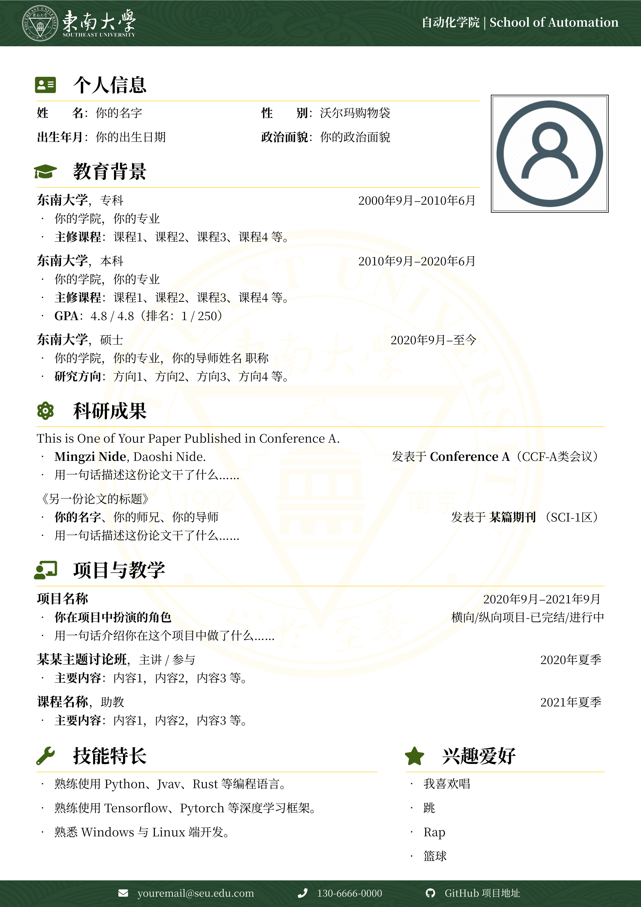

# SEU-CV：东南大学 LaTeX 中文简历模板

## 简介

基于 [WHU 中文 CV 模板](https://www.overleaf.com/latex/templates/whuwu-han-da-xue-zhong-wen-jian-li-mo-ban/dbkvxrqjmzpd)以及 [NPU 中文 CV 模板](https://www.overleaf.com/latex/templates/npu-cv/mncqzxhvfzrx)的 SEU 中文 CV 模板。

在原有内容的基础上进行了修改：

- 更改了照片和个人信息栏位的相对位置，可以插入更大的照片
- 更改了校徽图标（参考 https://github.com/seumxc/SEU-Logo）
- 更改了部分段落的格式
- 调整了装饰图案的色彩风格
- 更改了字体（`NotoSefirSC`，已内置在项目文件夹中）

## 使用方法

- 编辑 `main.tex` 中的内容，对文档样式和内容进行修改。
- 使用 `XeLaTeX` 或 `LuaLaTeX` 编译。